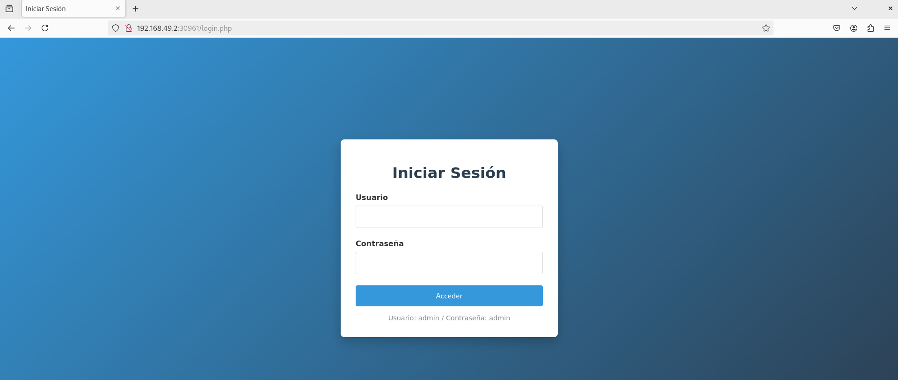
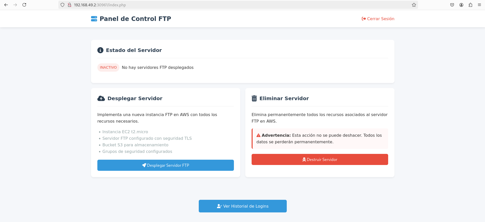
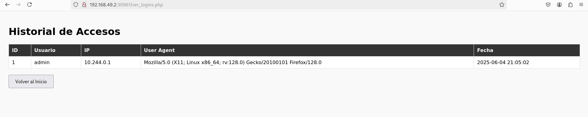

# Manual del Proyecto - Sistema Web para Despliegue Automatizado de Infraestructura FTP en AWS usando Terraform

## 📑 Índice

1. [Introducción](#1-introducción)  
2. [Descripción General del Proyecto](#2-descripción-general-del-proyecto)  
3. [Requisitos Previos](#3-requisitos-previos)  
4. [Estructura del Repositorio](#4-estructura-del-repositorio)  
5. [Guía de Instalación y Ejecución](#5-guía-de-instalación-y-ejecución)  
6. [Tecnologías Utilizadas](#6-tecnologías-utilizadas)  
7. [Funcionamiento del Proyecto](#7-funcionamiento-del-proyecto)   
8. [Conclusiones y Futuras Mejoras](#9-conclusiones-y-futuras-mejoras)

---

## 1. Introducción

Este documento técnico detalla la implementación de una infraestructura automatizada en la nube de Amazon Web Services (AWS), cuyo objetivo es permitir el despliegue y destrucción de recursos mediante Terraform, con una interfaz web sencilla creada con PHP.

---

## 2. Descripción General del Proyecto
El sistema mediante el despliegue de un clúster de **EKS** con un Deployment que lanza un contenedor de **nginx** con una aplicación PHP. Permite desplegar en AWS, de forma automatizada, una infraestructura que incluye:

- Una aplicación PHP permite autenticación de usuarios y registra los inicios de sesión en una base de datos SQLite.
- Al interactuar con la aplicación, se lanza un despliegue con **Terraform** que crea:
  - Una **VPC** con subred pública y subred privada.
  - Un **grupo de seguridad** configurado.
  - Una **instancia EC2** con un servidor **FTP seguro (TLS)**.
  - Un **bucket de S3** donde se almacenan los archivos subidos al servidor FTP.
  - Un **bucket adicional de S3** ( ya creado previamente ), donde se guarda el estado remoto de Terraform (`terraform.tfstate`).

La destrucción de la infraestructura también es automatizada y deja constancia del estado actualizado en el bucket correspondiente.

---

## 3. Requisitos Previos

Antes de ejecutar el proyecto, se deben cumplir los siguientes requisitos:

- Cuenta activa en **AWS**.
- **Terraform** instalado y configurado (`terraform init`).
- **kubectl** configurado para acceder a EKS.
- **AWS CLI** instalado y configurado (`aws configure`).
- Docker instalado (si se desea reconstruir la imagen).
- Git instalado.

---

## 4. Estructura del Repositorio
* ./backend/*
    * bucket.tf
    * main.tf
    * outputs.tf
    * provider.tf
    * subredes.tf
    * variables.tf

* ./config/*
    * database.php

* ./frontend/*
    * deploy.php
    * destroy.php
    * index.php
    * login.php
    * logout.php
    * upload_state.php
    * ver_logins.php

* ./k8s/*
    * deployment.yaml
    * service.yaml

* ./aws-config/*
    * credentials

* ./Dockerfile

* ./nginx.conf

## 5. Guía de Instalación y Ejecución

Al tener que levantar el laboratorio cada vez que lo queramos usar las claves de la cuenta van cambiando. Entonces para que funcione el proyecto hay que hacer lo siguiente: *( Quiero decir que si fuera una cuenta normal no haría falta hacer nada de esto y sería más eficiente ).*

### 5.1. Cambiar la claves.
Hay tres sitios donde se deben cambiar:

* El primero en el archivo **./aws-config/credentials** que es donde va a coger nginx las claves de aws para poder desplegar en aws.

* Segundo dentro del **./backend/main.tf** para que se pueda montar el bucket con el FTP.

* Y por ultimo en la instancia donde tengamos conectado el cluster de eks, en mi caso es una máquina debian y estan dentro de **~/.aws/credentials**

### 5.2. Renovar la imagen y levantar el deployment.

Creamos la imagen con las nuevas claves y lo subimos a docker para que vuelva a coger el deployment la imagen correcta

            docker build -t alvarodoca/ftp-deploy:latest .
            docker push alvarodoca/ftp-deploy:latest

            kubectl apply -f k8s/deployment.yaml
            kubectl apply -f k8s/service.yaml

## 6. Tecnologías Utilizadas

He usado:

* Terraform
* AWS
* Nginx
* Sqlite
* PHP
* Docker
* FTP
* TLS
* DNSexit

## 7. Funcionamiento del Proyecto
Sale primero una página de login, el usuario es admin y la contraseña admin.

---
Después entras en un menú que te da tres opciones, desplegar el servidor FTP, destruirlo, y ver los logins que ha tenido la página.

---

Esta es la página de los logins.

## 8. Conclusiones y Futuras Mejoras

Yo mejoraría la parte de la base de datos, buscar otra o hacerla diferente para que se quede persistente porque cada vez que se destruye el deployment se van a ir todos los datos.

También el tema de ver como se podria desde la página con un menú o formulario cambiar datos del FTP que se va a desplegar, como que usuarios crear dentro, los límites de subida, etc...

Otra cosa que se podría mejorar es securizar nginx para usar el https con un certificado.